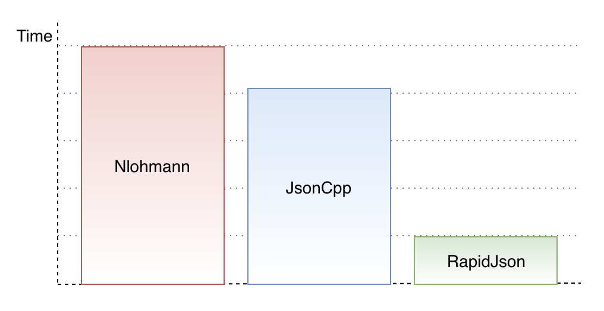
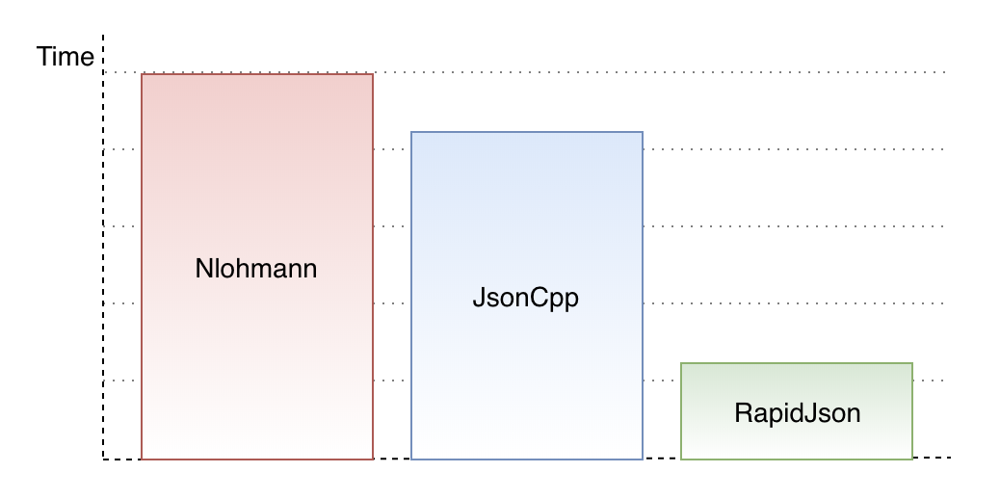
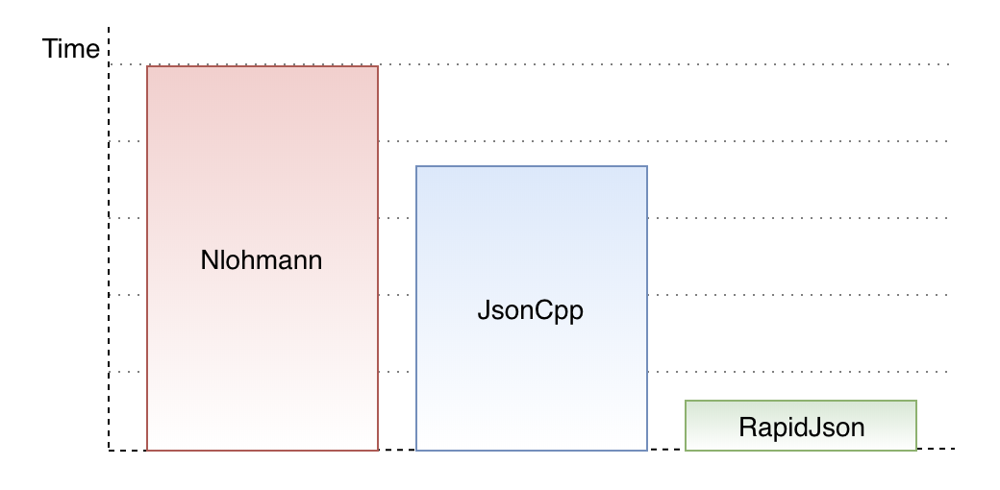
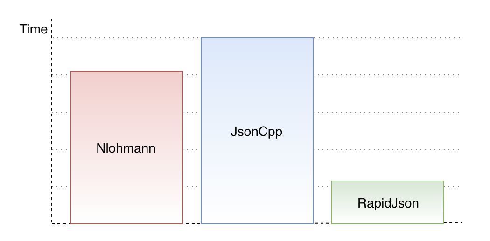

# JSON Geek Benchmark

[JSON for Modern C++](https://github.com/nlohmann/json)
vs [RapidJSON](http://rapidjson.org)
vs [JsonCpp](https://github.com/open-source-parsers/jsoncpp)

## Benchmark Result

```bash
Run on (8 X 2300 MHz CPU s)
CPU Caches:
  L1 Data 32K (x4)
  L1 Instruction 32K (x4)
  L2 Unified 262K (x4)
  L3 Unified 6291K (x1)
-----------------------------------------------------------------------
Benchmark                                Time           CPU Iterations
-----------------------------------------------------------------------
NlCreateJson/iterations:1000000       5749 ns       5740 ns    1000000    2.6581MB/s   170.118k items/s
NlFromJson/iterations:1000000         6342 ns       6334 ns    1000000
NlToJson/iterations:1000000           4497 ns       4491 ns    1000000
NlStringify/iterations:1000000        6174 ns       6165 ns    1000000

RaCreateJson/iterations:1000000       1296 ns       1295 ns    1000000   70.7089MB/s   754.229k items/s
RaFromJson/iterations:1000000         1600 ns       1598 ns    1000000
RaToJson/iterations:1000000            366 ns        366 ns    1000000
RaStringify/iterations:1000000        1464 ns       1462 ns    1000000

JcCreateJson/iterations:1000000       5030 ns       5022 ns    1000000   7.59585MB/s   194.454k items/s
JcFromJson/iterations:1000000         5566 ns       5558 ns    1000000
JcToJson/iterations:1000000           3029 ns       3025 ns    1000000
JcStringify/iterations:1000000        6629 ns       6621 ns    1000000
```

```bash
Run on (4 X 3600 MHz CPU s)
CPU Caches:
  L1 Data 32K (x4)
  L1 Instruction 32K (x4)
  L2 Unified 256K (x4)
  L3 Unified 6144K (x1)
***WARNING*** CPU scaling is enabled, the benchmark real time measurements may be noisy and will incur extra overhead.
-----------------------------------------------------------------------
Benchmark                                Time           CPU Iterations
-----------------------------------------------------------------------
NlCreateJson/iterations:1000000       3424 ns       3424 ns    1000000   4.45645MB/s   285.213k items/s
NlFromJson/iterations:1000000         3605 ns       3605 ns    1000000
NlToJson/iterations:1000000            946 ns        946 ns    1000000
NlStringify/iterations:1000000        2053 ns       2053 ns    1000000

RaCreateJson/iterations:1000000        666 ns        666 ns    1000000   137.484MB/s   1.43212M items/s
RaFromJson/iterations:1000000          891 ns        891 ns    1000000
RaToJson/iterations:1000000            172 ns        172 ns    1000000
RaStringify/iterations:1000000         678 ns        678 ns    1000000

JcCreateJson/iterations:1000000       2565 ns       2565 ns    1000000   14.8709MB/s   380.696k items/s
JcFromJson/iterations:1000000         2903 ns       2903 ns    1000000
JcToJson/iterations:1000000            767 ns        767 ns    1000000
JcStringify/iterations:1000000        2906 ns       2906 ns    1000000
```

## Str -> JSON



## JSON -> C++ struct



## C++ struct -> JSON



## C++ struct -> Str


